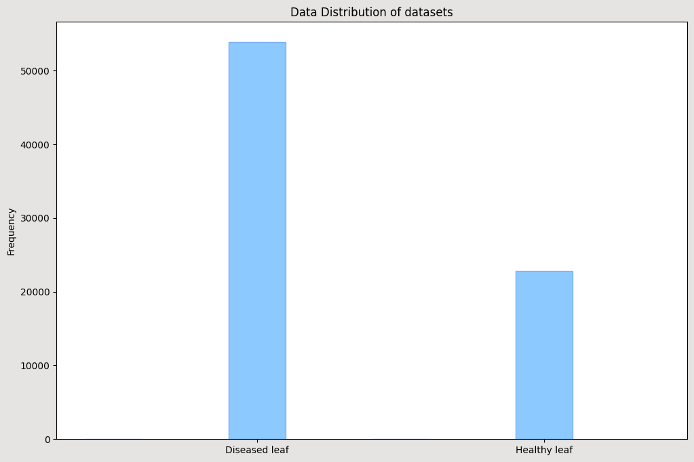

# Plant Health Classification model :

- The main aim of the model is to classify based on the image given whether the plant is healthy or not. 

## Motivation :

- Due to climatic changes, the temperature is increasing rapidly. The number of diseases caused by bacterial, fungal, and viral infections are increased rapidly which can decrease the yield of the crop upto 80%.

- As food demand are increasing yearly, it is vital to increase the food production and prevent the decrease in yield due to crop diseases. 

- The idea is that as autonomous vehicle are being used to spray pesticides for the crops instead of doing it manually to reduce cost and increase the safety of humans from exposture to pesticides. A cameracan be fixed in the autonomous vehicle such that it takes image of the crop and the model predicts whether the crop is healthy or not based on the leaf color,etc..

## Datasets Used :

- Three dataset has been used to train the model. They are as follows :
  
  1. New Plant Disease Dataset (Augmented) [link](https://www.kaggle.com/datasets/vipoooool/new-plant-diseases-dataset)
  
  2. Plant Disease Recognisation [link](https://www.kaggle.com/datasets/rashikrahmanpritom/plant-disease-recognition-dataset?rvi=1)
  
  3. Grape Vine Disease Dataset [link](https://www.kaggle.com/datasets/rm1000/grape-disease-dataset-original/data)


---

## Data cleaning :

- As the dataset contains the data for each disease prediction which is not necessary for our model classification. We first merge all the healthy datasets of tomato,potato into healthy and all the diseased data into not healthy

- Once we have done that, as each images have their own resolution. We fix the image resolution as **224 X 224** for easy training and testing.

## Data Visualization :

- Once the data is loaded, we apply histogram to know the distribution of datasets.



- From the plot above we can see that the dataset is imbalanced. so we balance using some augmentation on the image from healthy to balance the dataset. After doing some augmentation, the dataset gets nearly balanced.


---

# Model Training :


## Simple CNN model :

- For start, I created a simple CNN model which will be used to classify the images as healthy or not healthy value.

```
Model: "sequential"
_________________________________________________________________
 Layer (type)                Output Shape              Param #   
=================================================================
 max_pooling2d (MaxPooling2  (None, 112, 112, 3)       0         
 D)                                                              
                                                                 
 dense (Dense)               (None, 112, 112, 32)      128       
                                                                 
 dropout (Dropout)           (None, 112, 112, 32)      0         
                                                                 
 dense_1 (Dense)             (None, 112, 112, 64)      2112      
                                                                 
 dropout_1 (Dropout)         (None, 112, 112, 64)      0         
                                                                 
 dense_2 (Dense)             (None, 112, 112, 32)      2080      
                                                                 
 flatten (Flatten)           (None, 401408)            0         
                                                                 
 dense_3 (Dense)             (None, 16)                6422544   
                                                                 
 dense_4 (Dense)             (None, 2)                 34        
                                                                 
=================================================================
Total params: 6426898 (24.52 MB)
Trainable params: 6426898 (24.52 MB)
Non-trainable params: 0 (0.00 Byte)
_________________________________________________________________
```

- After some training, we find that the model is finding it difficult to learn the pattern from the images. 


- Due to limitation of resource in training a model from scratch can take lots of time. We are going to transfer learning so that the model will use the pattern the model and do the classification more effectively.

## Transfer Learning :

- We are using the pretrained model from kaggle which is used to predict 38 class.As we need to  classify whether the plant health is good or not. We remove the last layer and replace it with a dense layer of 2 neurons.

```
Model: "model"
_________________________________________________________________
 Layer (type)                Output Shape              Param #   
=================================================================
 input_2 (InputLayer)        [(None, 224, 224, 3)]     0         
                                                                 
 tf.cast (TFOpLambda)        (None, 224, 224, 3)       0         
                                                                 
 tf.__operators__.getitem (  (None, 224, 224, 3)       0         
 SlicingOpLambda)                                                
                                                                 
 tf.nn.bias_add (TFOpLambda  (None, 224, 224, 3)       0         
 )                                                               
                                                                 
 resnet50 (Functional)       (None, 7, 7, 2048)        23587712  
                                                                 
 global_average_pooling2d (  (None, 2048)              0         
 GlobalAveragePooling2D)                                         
                                                                 
 dense (Dense)               (None, 128)               262272    
                                                                 
 dense_1 (Dense)             (None, 64)                8256      
                                                                 
 dense_3 (Dense)             (None, 2)                 130       
                                                                 
=================================================================
Total params: 23858370 (91.01 MB)
Trainable params: 270658 (1.03 MB)
Non-trainable params: 23587712 (89.98 MB)
_________________________________________________________________

```

- At beginning we freezed the previous layer except the last layer so the last layer will learn the adjust the weights such that the model pattern.


- Then we train the entire model with the dataset we have combined and try to improve the model accuracy.


## Results :

- the modelis then tested with the test dataset and gives the following predictions

```
 precision    recall  f1-score   support

           0       0.99      0.97      0.98      1509
           1       0.92      0.96      0.94       479

    accuracy                           0.97      1988
   macro avg       0.95      0.97      0.96      1988
weighted avg       0.97      0.97      0.97      1988

```

- **It gives an precision of 91% and recall of 96%. The f1 score of the model is 94%**
